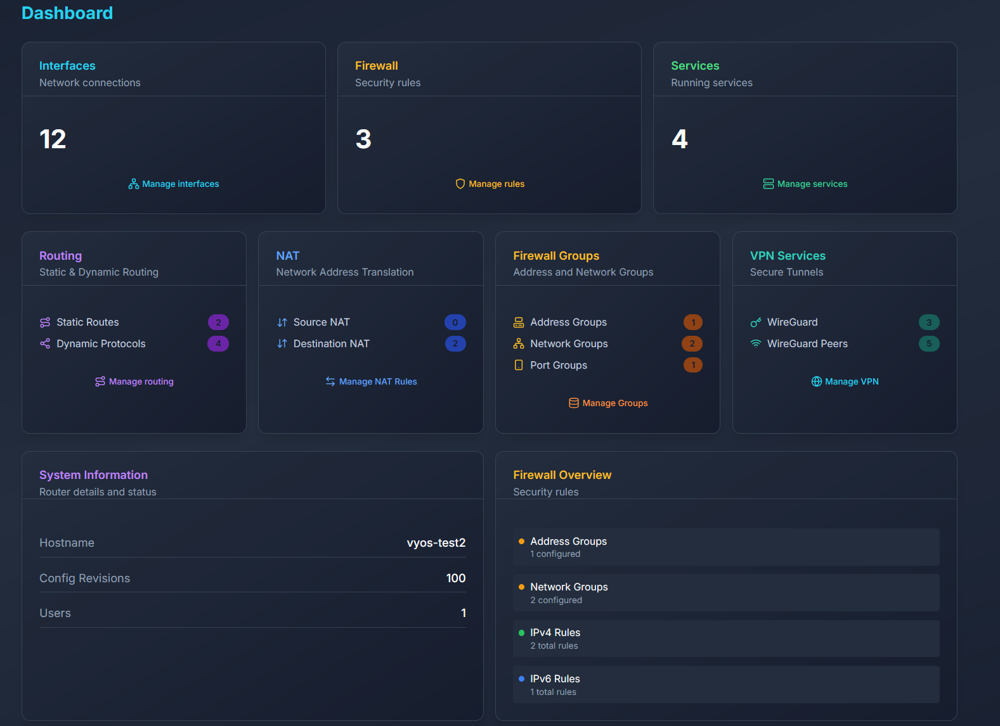

# VyManager

Modern web interface to make configuring, deploying and monitoring VyOS routers easier

## VyOS Version Support
Currently being developed for:
- VyOS 1.4-sagitta **(full)**
- VyOS 1.5-circinus **(partial)**

**[Skip to Configuration and Installation](https://github.com/Community-VyProjects/VyManager#configuration)**

**Feel free to add a star ⭐ to our project if you like to use it!**

[💭 Feel free to join our official Discord community](https://discord.gg/k9SSkK7wPQ)

**[Live Demo (limited uptime during some periods)](https://vymanager.vyprojects.org)**



---

## Features

- **Dashboard Overview**: View system info, interfaces, and services at a glance
- **Configuration Management**: Browse and edit VyOS configurations through a user-friendly interface
- **Interface Management**: See details of all network interfaces and edit their properties
- **Firewall Management**: Configure firewall rules, policies, and address groups
- **Routing**: Manage static routes, dynamic routing protocols, and view routing tables
- **NAT**: Configure source and destination NAT rules
- **VPN**: Manage VPN configurations and monitor connections
- **Services**: Configure DHCP, DNS, NTP, and SSH services
- **Containers**: Manage and monitor containers (Podman)
- **Modern UI**: Built with Next.js, React, TypeScript, and Tailwind CSS for a responsive experience
- **Dark Mode**: Optimized dark interface for reduced eye strain

## Architecture

This project consists of two main components:

1. **Backend API**: Python-based FastAPI application that interfaces with VyOS CLI to manage configurations
2. **Frontend**: Next.js application built with React, TypeScript, and Shadcn UI components

## Prerequisites

- Node.js 18+ for the frontend (only for manual install)
- Python 3.11+ for the backend (only for manual install)
- VyOS router with API access enabled (see configuration for securely enabling API access)
- Docker and Docker Compose or Podman and Podman Compose (optional, for containerized deployment)

---

## Configuration

Before you start, ensure you're connected to the VyOS router via the terminal/shell. You need to do follow both VyOS router setup and Environment values.

### Step 1) Setup VyOS routers:
Setup the HTTPS REST API in your VyOS router(s), using the following CLI commands:

1. Start configuration mode:
``` conf ```

2. Create a HTTPS key:
>💡Security Notice: replace KEY with a really secure key, it's like a password! You will need to enter this password in your backend .env file in the next steps!
``` set service https api keys id fastapi key KEY ```

3. (only required on VyOS 1.5 and above) Enable the REST functionality:
``` set service https api rest ```

4. (optional) Enable GraphQL functionality:
``` set service https api graphql ```

5. Save your changes in CLI (run these **two** commands chronologically):
``` commit ```, then ``` save ```


### Step 2) Environment values:
Next you will need to configure your environment configuration files, make sure you configure both .env files in /frontend and /backend!
For each one, you can find an example .env configuration file in the belonging directories.

1) Configuration in /backend path:
Create a `.env` file in the root directory with the following configuration:

```
VYOS_HOST=your-vyos-router-ip
VYOS_API_KEY=your-api-key
VYOS_HTTPS=true
TRUST_SELF_SIGNED=true  # For self-signed certificates
ENVIRONMENT=production  # or development
```

2) Configuration in /frontend directory:
Create a `.env` file in the /frontend directory with the following configuration:
```
NEXT_PUBLIC_API_URL=http://localhost:3001
```

---

## Installation

### Using Containers (Recommended)

The easiest way to run the application is using either Docker Compose or Podman Compose, for such make sure you have both docker and docker-compose or podman and podman-compose installed:

#### Using Prebuilt Docker Images
```bash
cd container

# Build and start the container
docker-compose -f prebuilt_images_compose.yaml up -d

# View logs
docker-compose -f prebuilt_images_compose.yaml logs -f
```

#### Building Your Own Docker Images
```bash
cd container

# Build and start the container
docker-compose -f env_file_compose.yaml up -d

# View logs
docker-compose -f env_file_compose.yaml logs -f
```

#### Podman
```bash
cd container

# Build and start the container
podman compose -f env_file_compose.yaml up -d

# View logs
podman compose -f env_file_compose.yaml logs -f
```

For more detailed instructions, see [README-docker.md](docs/README-container.md).

### Manual Installation

#### Backend

```bash
# Install Python dependencies
pip install -r requirements.txt

# Configure your VyOS connection in .env file
# See .env.example for required variables

# Run the backend server
uvicorn main:app --host 0.0.0.0 --port 3001
```

#### Frontend

```bash
# Navigate to the frontend directory
cd frontend

# Install dependencies
npm install

# Start the development server
npm run dev

# Build for production
npm run build
npm start
```

## Accessing the Application

- Frontend (Next.js): http://localhost:3000
- Backend API (FastAPI): http://localhost:3001

## License

This project is licensed under GPL-3.0 - see the [LICENSE](LICENSE) file for details.

## Contributing

Contributions are welcome! Please feel free to submit a Pull Request.
